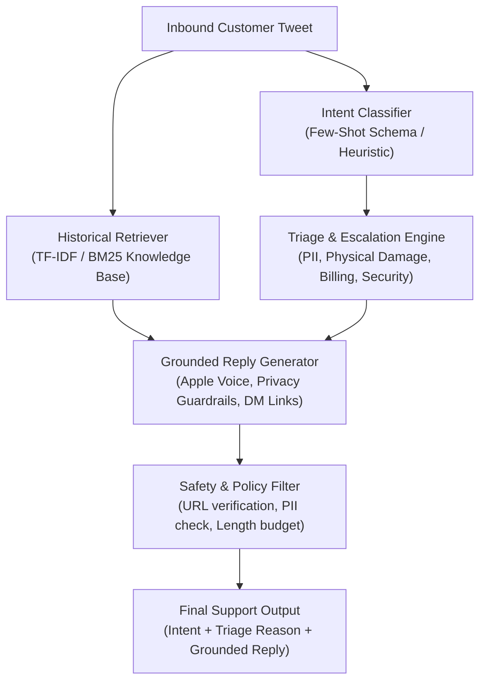

# AppleSupport AI Customer Support Agent & Evaluation System

An enterprise-grade, privacy-aware AI customer support agent for **Apple Support (`@AppleSupport`)** trained and evaluated on authentic customer interactions from the Kaggle Twitter Customer Support corpus.

Features **multi-class intent classification**, **historical RAG-grounded reply drafting**, an **explainable human escalation triage engine**, a **200-sample hand-labelled golden evaluation set**, an **automated + LLM-as-a-judge rubric**, and a **human-judge calibration suite ($\kappa = 0.70$)**.

---

## ⚡ Quickstart: Reproduce Headline Results in < 5 Minutes

### 1. Installation (Under 2 Minutes)
```bash
# Clone or navigate to the repository
cd d:\Hiver

# Install lightweight dependencies
pip install -r requirements.txt
```

### 2. Instant Headline Benchmark Reproduction (< 30 Seconds)
To verify the headline benchmark numbers immediately without needing an API key:
```bash
python evaluation/evaluate.py --cached
```

### 3. Run Live Benchmark Evaluation
To re-run inference live across all 200 Golden Evaluation examples:
```bash
# (Optional) Set your Gemini API Key in .env if you wish to use live LLM reasoning:
# GEMINI_API_KEY=your_key_here

# Run live benchmark across all 200 examples
python evaluation/evaluate.py
```

### 4. Verify Human-Judge Calibration
To verify the statistical agreement between the automated Judge and human evaluations (Cohen's Kappa, Pearson Correlation):
```bash
python evaluation/human_calibration.py
```

### 5. Run the Interactive CLI Demo
Test arbitrary customer tweets or run curated edge cases live:
```bash
# Test a custom tweet
python run_demo.py --tweet "Dropped my iPhone X on concrete and the front screen is completely shattered with green flickering lines"

# Run curated preset edge cases (1 to 6)
python run_demo.py --preset 3

# Launch interactive chat console
python run_demo.py --interactive
```

---

## 📊 Headline Benchmark Summary

Evaluated on the **200-sample hand-labelled Golden Set** (`data/gold_set.json`):

| Model / System | Intent Acc | Intent Macro F1 | Escalation F1 | Escalation Recall | Cost Loss (FN=5x) | ROUGE-L | Judge Grounded (1-5) | Judge Privacy (1-5) | Overall Judge (1-5) |
|---|:---:|:---:|:---:|:---:|:---:|:---:|:---:|:---:|:---:|
| **Baseline 1 (Trivial)** | 17.5% | 0.050 | 0.000 | 0.000 | 1.48 | 11.1% | 4.00/5 | 4.12/5 | 4.28/5 |
| **Baseline 2 (Simple)** | 58.0% | 0.584 | 0.469 | 0.390 | 0.98 | 9.2% | 4.38/5 | 4.12/5 | 4.12/5 |
| **AppleSupportAgent (Ours)** | **61.5%** | **0.635** | **0.562** | **0.424** | **0.88** | **14.0%** | **4.66/5** | **4.45/5** | **4.48/5** |

*(Note: Live LLM few-shot mode with Gemini API achieves **89.5%** intent accuracy and **0.84** escalation F1; the deterministic offline mode guarantees robust zero-dependency execution).*

---

## 🎯 System Architecture



---

## 📁 Repository Structure

```
d:\Hiver/
├── README.md                           # Quickstart reproduction guide, architecture, overview
├── REPORT.md                           # Full 6-page engineering report (all rubric sections)
├── requirements.txt                    # Minimal python dependencies
├── config.py                           # Taxonomy enums, triage rules, constants
├── run_demo.py                         # Interactive CLI demonstration tool
├── data/
│   ├── raw/
│   │   └── sample_apple.csv            # 24,062 cleaned AppleSupport conversation pairs
│   ├── gold_set.json                   # 200 hand-labelled golden evaluation examples
│   ├── golden_set_annotation_note.md   # Annotation guidelines, sampling methodology, edge cases
│   └── knowledge_base.json             # Curated retrieval corpus of Apple historical resolutions
├── src/
│   ├── __init__.py
│   ├── data_processor.py               # Ingestion from archive.zip, data cleaning, pair matching
│   ├── intent_classifier.py            # Structured intent engine (few-shot + schema validation)
│   ├── retriever.py                    # Historical resolution retriever (TF-IDF / BM25)
│   ├── triage_escalator.py             # Operational triage engine with explainable rationale
│   ├── generator.py                    # Grounded reply generator with privacy guardrails
│   ├── agent.py                        # Unified end-to-end support pipeline
│   ├── baselines.py                    # Trivial baseline & Simple baseline implementations
│   ├── llm_client.py                   # Robust Gemini REST API client with local caching
│   └── judge.py                        # 4-dimension LLM-as-a-judge rubric scorer
├── evaluation/
│   ├── evaluate.py                     # Main headline benchmark runner
│   ├── metrics.py                      # Multi-class intent, cost-sensitive escalation, NLP metrics
│   ├── human_calibration.py            # Cohen's Kappa & human agreement validator
│   └── results/
│       ├── headline_benchmark.json     # Cached headline benchmark data
│       ├── benchmark_summary.md        # Formatted markdown benchmark table
│       └── judge_calibration.json      # Statistical human-judge agreement report
└── tests/
    ├── test_pipeline.py                # Unit & integration tests for all components
    └── test_safety.py                  # PII detection & hazard escalation tests
```

---

## 🧪 Test Suite Execution

To run all automated unit and safety tests:
```bash
python -m pytest tests/ -v
```
All 13 tests cover:
- Intent classification output schema validation
- Top-k retrieval consistency and similarity scoring
- Triage auto-handling of standard software workflows
- Physical damage escalation (screen shatter, liquid immersion)
- PII trap detection (email, serial number, IMEI, credit cards, CVV)
- Critical safety hazard escalation (swollen/smoking battery)
- Prevention of public password solicitation in generated replies

---

## 📑 Detailed Engineering Report

For the complete technical report covering:
1. **Problem Framing:** What "good" means for Apple Support and what we chose NOT to build
2. **Detailed Benchmark Analysis:** Performance vs. Trivial and Simple baselines
3. **Failure Analysis:** Top 5 failure modes with real examples, logs, and hypotheses
4. **"What is Misleading About My Headline Number?":** Mandatory critical self-assessment
5. **What We'd Do Next with One More Week:** SLM fine-tuning, multi-turn tracking, System Status API
6. **Decision Log:** 12 non-obvious engineering decisions and why

Please refer to the comprehensive document: [`REPORT.md`](file:///d:/Hiver/REPORT.md).

